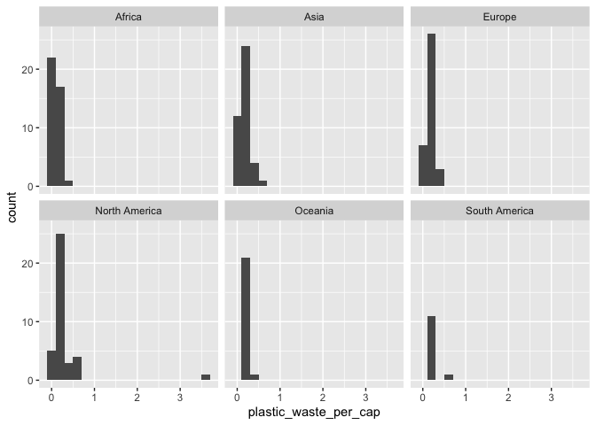
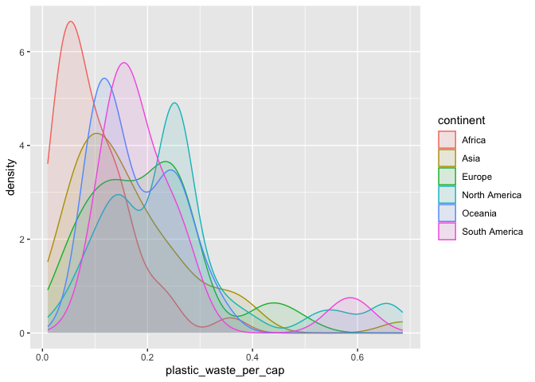

Lab 02 - Plastic waste
================
Lindsey Wilson
1/19/23

## Load packages and data

``` r
library(tidyverse) 
```

``` r
plastic_waste <- read.csv("data/plastic-waste.csv")
```

## Exercises

### Exercise 1

Here we have the plastic waste per capita separated by continent

``` r
ggplot(
  data = plastic_waste,
  aes(x = plastic_waste_per_cap),
  color = continent) +
  geom_histogram(binwidth = 0.2) +
  facet_wrap(~ continent)
```

    ## Warning: Removed 51 rows containing non-finite values (`stat_bin()`).

<!-- -->

### Exercise 2

#### 2.1

If we include all of the countries, the plot looks like this:

``` r
ggplot(data = plastic_waste, 
       mapping = aes(x = plastic_waste_per_cap, 
                     color = continent, 
                     fill = continent)) +
  geom_density(alpha = 0.1)
```

    ## Warning: Removed 51 rows containing non-finite values (`stat_density()`).

<!-- -->

But the one outlier point on the far right is still throwing things off.
By running this code, we can identify that data point as coming from
Trinidad & Tobago:

``` r
plastic_waste %>%
  filter(plastic_waste_per_cap > 3.5)
```

    ##   code              entity     continent year gdp_per_cap plastic_waste_per_cap
    ## 1  TTO Trinidad and Tobago North America 2010    31260.91                   3.6
    ##   mismanaged_plastic_waste_per_cap mismanaged_plastic_waste coastal_pop
    ## 1                             0.19                    94066     1358433
    ##   total_pop
    ## 1   1341465

The plot might be a little more useful if we filter Trinidad & Tobago
out. We’ve done that below:

``` r
plastic_waste_filtered <- plastic_waste %>%
  filter(code != "TTO")

ggplot(data = plastic_waste_filtered, 
       mapping = aes(x = plastic_waste_per_cap, 
                     color = continent, 
                     fill = continent)) +
  geom_density(alpha = 0.1)
```

    ## Warning: Removed 51 rows containing non-finite values (`stat_density()`).

<!-- -->

#### 2.2

`color` and `fill` are defined by mapping aesthetics of the plot because
they’re meaningful; we want them to be mapped to the `continent`
variable Defining those two characteristics as properties of the plot
makes sure that they always agree, and allows us to play around with the
type of visualization we want to use without breaking that binding.

In contrast `alpha` is a property of the geom because we want it to be
the same for all of the curves; we don’t want it to be based on a
variable. For example, we don’t want the curve for North America to be
more transparent than the curve for Africa.

### Exercise 3

Remove this text, and add your answer for Exercise 3 here.

### Exercise 4

Remove this text, and add your answer for Exercise 4 here.

``` r
# insert code here
```

### Exercise 5

Remove this text, and add your answer for Exercise 5 here.

``` r
# insert code here
```

### Exercise 6

Remove this text, and add your answer for Exercise 6 here.

``` r
# insert code here
```

### Exercise 7

Remove this text, and add your answer for Exercise 7 here.

``` r
# insert code here
```

``` r
# insert code here
```

### Exercise 8

Remove this text, and add your answer for Exercise 8 here.

``` r
# insert code here
```
