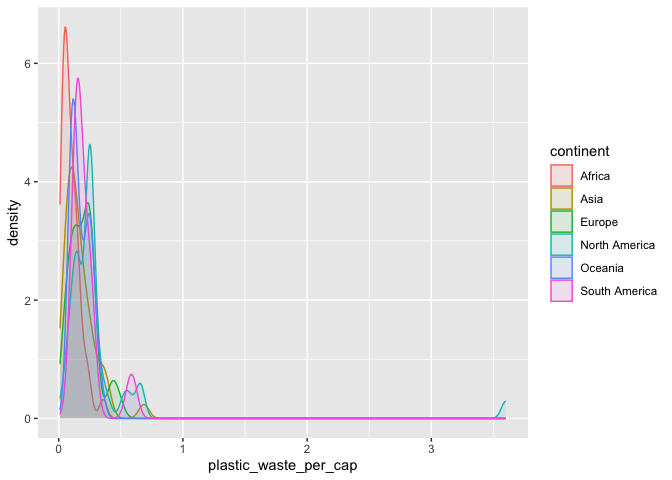
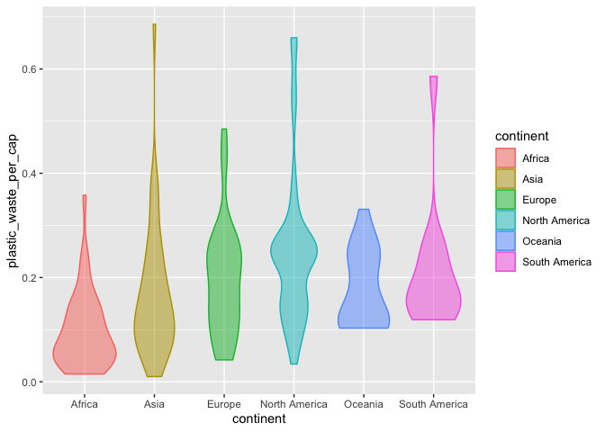

Lab 02 - Plastic waste
================
Lindsey Wilson
1/19/23

## Load packages and data

``` r
library(tidyverse) 
```

``` r
plastic_waste <- read.csv("data/plastic-waste.csv")
```

## Exercises

### Exercise 1

Here we have the plastic waste per capita separated by continent

``` r
ggplot(
  data = plastic_waste,
  aes(x = plastic_waste_per_cap),
  color = continent) +
  geom_histogram(binwidth = 0.2) +
  facet_wrap(~ continent)
```

    ## Warning: Removed 51 rows containing non-finite values (`stat_bin()`).

<!-- -->

### Exercise 2

#### 2.1

If we include all of the countries, the plot looks like this:

``` r
ggplot(data = plastic_waste, 
       mapping = aes(x = plastic_waste_per_cap, 
                     color = continent, 
                     fill = continent)) +
  geom_density(alpha = 0.1)
```

    ## Warning: Removed 51 rows containing non-finite values (`stat_density()`).

<!-- -->

But the one outlier point on the far right is still throwing things off.
By running this code, we can identify that data point as coming from
Trinidad & Tobago:

``` r
plastic_waste %>%
  filter(plastic_waste_per_cap > 3.5)
```

    ##   code              entity     continent year gdp_per_cap plastic_waste_per_cap
    ## 1  TTO Trinidad and Tobago North America 2010    31260.91                   3.6
    ##   mismanaged_plastic_waste_per_cap mismanaged_plastic_waste coastal_pop
    ## 1                             0.19                    94066     1358433
    ##   total_pop
    ## 1   1341465

The plot might be a little more useful if we filter Trinidad & Tobago
out. We’ve done that below (and will continue to do that for the
remaining plots):

``` r
plastic_waste_filtered <- plastic_waste %>%
  filter(code != "TTO")

ggplot(data = plastic_waste_filtered, 
       mapping = aes(x = plastic_waste_per_cap, 
                     color = continent, 
                     fill = continent)) +
  geom_density(alpha = 0.1)
```

    ## Warning: Removed 51 rows containing non-finite values (`stat_density()`).

<!-- -->

#### 2.2

`color` and `fill` are defined by mapping aesthetics of the plot because
they’re meaningful; we want them to be mapped to the `continent`
variable. Defining those two characteristics as properties of the plot
makes sure that they always agree, and allows us to play around with the
type of visualization we want to use without breaking that binding.

In contrast `alpha` is a property of the geom because we want it to be
the same for all of the curves; we don’t want it to be based on a
variable. For example, we don’t want the curve for North America to be
more transparent than the curve for Africa.

### Exercise 3

Let’s try next to represent out data as a set of violin plots. These
differ from box plots because, while a boxplot only shows summary
statistics, violin plots show the density of the data at each point
along the y-axis.

Below we have our data represented with violin plots:

``` r
ggplot(data = plastic_waste_filtered,
       mapping = aes(x = continent,
                     y = plastic_waste_per_cap,
                     color = continent,
                     fill = continent)) + 
  geom_violin(alpha = 0.5)
```

    ## Warning: Removed 51 rows containing non-finite values (`stat_ydensity()`).

<!-- --> \###
Exercise 4

#### 4.1

Let’s now try plotting the data as a scatterplot:

``` r
ggplot(data = plastic_waste_filtered,
       mapping = aes(x = plastic_waste_per_cap,
                     y = mismanaged_plastic_waste_per_cap)) + 
  geom_point()
```

    ## Warning: Removed 51 rows containing missing values (`geom_point()`).

<!-- -->

This looks like a pretty strong positive correlation, and we can confirm
this directly:

``` r
cor(plastic_waste_filtered$plastic_waste_per_cap, plastic_waste_filtered$mismanaged_plastic_waste_per_cap, 
    use = "complete.obs")
```

    ## [1] 0.0822064

So the relationship isn’t terribly strong, but it is positive. As you
increase the amount of plastic waste per person, you also increase the
amount of that plastic waste that’s mismanaged.

#### 4.2

We might gain some additional insights if we color the data points by
continent:

``` r
ggplot(data = plastic_waste_filtered,
       mapping = aes(x = plastic_waste_per_cap,
                     y = mismanaged_plastic_waste_per_cap,
                     color = continent)) + 
  geom_point()
```

    ## Warning: Removed 51 rows containing missing values (`geom_point()`).

<!-- -->

From this we can see that continents appear to differ in how bad they
are about mismanagement. African countries, for example, seem to be
pretty bad about it; for every unit of plastic waste generated, a lot of
it seems to get mismanaged. In contrast, Europe seems to be pretty good
about mismanagement. This doesn’t mean European countries aren’t
generating plastic waste, but not much of it is mismanaged once it is
produced

#### 4.3

We can visualize other relationships in the data as well. For example,
we can plot plastic waste per capita against total population (after
filtering out some population outliers to make things less compressed)

``` r
ggplot(data = filter(plastic_waste_filtered, total_pop < 1e9),
       mapping = aes(x = total_pop,
                     y = plastic_waste_per_cap,
                     color = continent)) + 
  geom_point()
```

    ## Warning: Removed 51 rows containing missing values (`geom_point()`).

<!-- -->

And plastic waste per capita against coastal population (again, sans
outliers):

``` r
ggplot(data = filter(plastic_waste_filtered, coastal_pop < 1.5e8),
       mapping = aes(x = coastal_pop,
                     y = plastic_waste_per_cap,
                     color = continent)) + 
  geom_point()
```

<!-- -->

On visual inspection it doesn’t look like either of these sets of
variables are more strongly linearly correlated than the other, but we
can check this by directly calculating the correlation coefficient for
both and comparing them:

``` r
#correlation between total population and plastic waste per capita
cor(plastic_waste_filtered$total_pop, plastic_waste_filtered$plastic_waste_per_cap,
    use = "complete.obs")
```

    ## [1] -0.1283867

``` r
#correlation between coastal population and plastic waste per capita
cor(plastic_waste_filtered$coastal_pop, plastic_waste_filtered$plastic_waste_per_cap,
    use = "complete.obs")
```

    ## [1] -0.1286294

So it looks like both associations are effectively the same strength.

### Exercise 8

Remove this text, and add your answer for Exercise 8 here.

``` r
# insert code here
```
